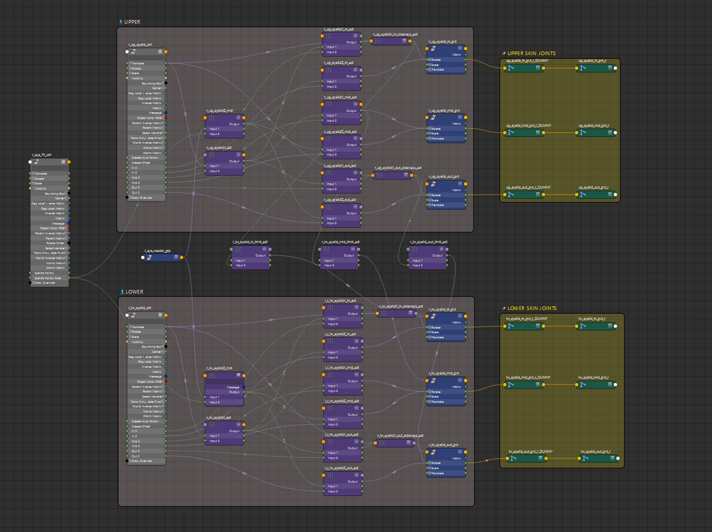
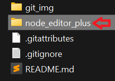
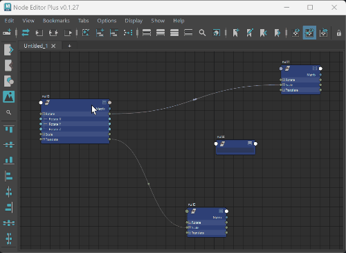
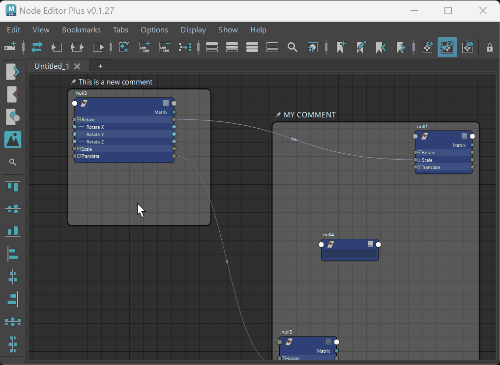
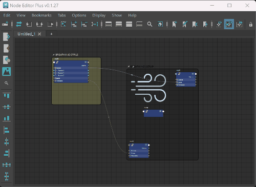
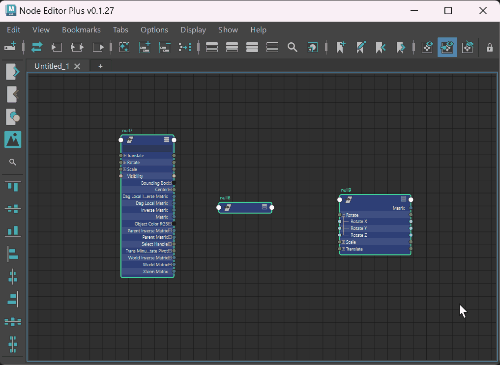
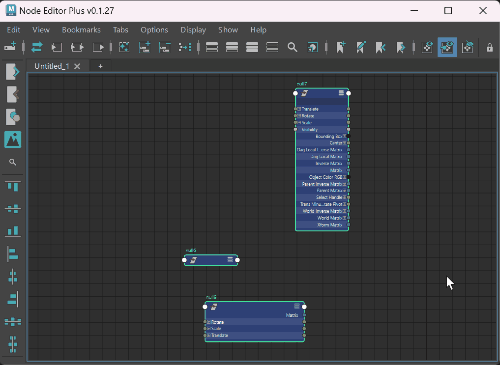
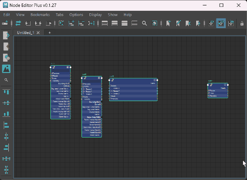

# Use this at your own risk, this is still pretty much experimental. It might occasionaly crash your Maya so please save frequently. Tested only on Maya 2023.

## Overview:
**Node Editor Plus (NEP)** is a script that overrides Maya's original Node Editor with extra capabilities such as Comment Nodes, ability to insert Images into the graph and align tools to organize nodes.
It is **NOT** recommended to alternate between the original Node Editor and Node Editor Plus, you may experience crashing or lose NEP data, so if you're using NEP stick to it and you shouldn't lose your work.

Using the original Node Editor will show your graphs and bookmarks as usual, but you won't be able to see our custom nodes (such as comments and images) and you may lose NEP data if you save using the original one and later reopen using NEP.

Like Maya's original Node Editor, NEP stores data per-scene in hidden nodes so avoid importing scenes with NEP data, this may generate unexpected behavior.




## Installation:
To install, copy the "node_editor_plus" folder to your Maya scripts dir. (**Note**: the folder to be copied is the one with a "\__init\__.py" inside)




After that, copy and run these lines of code in a Python command tab in Maya's script editor:
```
from node_editor_plus import node_editor_plus
nep = node_editor_plus.NodeEditorPlus()
nep.ui()
```
**It is recommended to add this command to a hotkey such as Shift+N and use it instead of the original Node Editor**


## Quickstart:
Hit "C" with some nodes selected to create comments. Press "B" with a comment selected to change the comment color.


## Command List:
### Custom Node Creation
+ C: Create Comment
+ F2: Rename Comment
+ B: Change Comment Color
+ Ctrl/Command + I: Pick New Image
+ Ctrl/Command + F: Show Search Menu

### Extended graphing capability: hover an attribute in the Node and press to graph
+ I: Graph Input
+ O: Graph Output

### Aligning functions - these also work with native nodes
+ Alt + Shift + W: Align Middle
+ Alt + Shift + S: Align Center
+ Shift + W: Align Top
+ Shift + S: Align Bottom
+ Shift + A: Align Left
+ Shift + D: Align Right
+ Shift + H: Distribute Horizontal
+ Shift + V: Distribute Vertical

## Demos:
Press "C" to create a new Comment around selected nodes. Double click the text to rename or press "F2". Everything inside a Comment Node will be dragged along with it.




Press "B" with at least one selected Comment to change colors.




Press "Ctrl+I" to import images. Images can be carried by Comment Nodes or pinned to the graph.


Press "Ctrl+F" to search Comments. Click on the Comment label to jump to its position in the graph.




Due to NEP's persistent nature, it will always warn you if you try an operation that clears the graph. If you want to supress the messages and clear everytime, there's a new option for that in the **Options** menu: "Node Editor Plus: Supress Confirm Dialogs"


Selective graphing: hovering any node's attribute and pressing "I" or "O" will additively graph the input/output connections if they exist.


Press "Shift+W", "Shift+S" and "Alt+Shift+W" to align vertically




Press "Shift+A", "Shift+D" and "Alt+Shift+S" to align horizontally




Press "Shift+H" and "Shift+V" to distribute spacing between nodes



## Credits:
+ [Rijah Kazuo](https://github.com/rijahkaz/) - overall maintenance of the code
+ [Danilo Pinheiro](https://github.com/nilouco) - added color capability to the comment nodes
+ [Camila Paulino Galva](https://github.com/campaulino) - added Align Tools capability and other improvements and fixes
+ [Rawda Elwalily](https://github.com/Ghalban) - sidebar icons and other improvements
+ [Ninette Tan](https://github.com/ntanimate) - improvements and fixes
